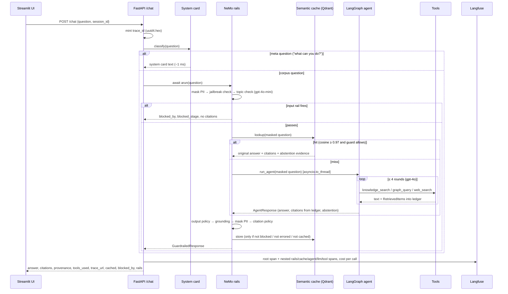
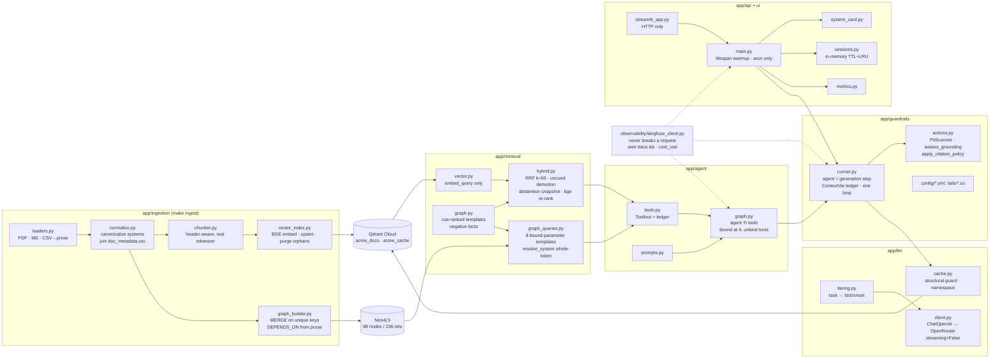
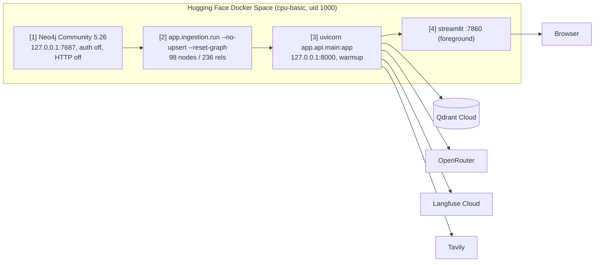

# Architecture

The Enterprise Knowledge Assistant is a hybrid vector + graph RAG system with a bounded
LangGraph agent, wrapped in NeMo Guardrails, served over FastAPI, cached in Qdrant, traced
to Langfuse, and deployed as a single Docker image on Hugging Face with Neo4j embedded.

This document describes the components, the data flow, and the design decisions with their
reasoning. Every number is from `evals/` or the commit history.

---

## 1. Request flow

## 2. Components

### Component table

| Component | Module | Responsibility | Key property |
|---|---|---|---|
| Settings | `app/config.py` | every knob, read once | measured defaults with the reason next to them |
| Loaders | `ingestion/loaders.py` | PDF / Markdown / CSV → `RawDocument` | CSVs rendered to prose under headings |
| Normalize | `ingestion/normalize.py` | canonical system names, metadata join, PDF cleanup | strict for `doc_metadata.csv`, lenient for prose |
| Chunker | `ingestion/chunker.py` | section-first, packed, windowed chunks | sized with the model's own tokenizer; raises above 512 |
| Vector index | `ingestion/vector_index.py` | BGE embeddings, Qdrant upsert + orphan purge | query prefix / no passage prefix; `points == chunks` asserted |
| Graph builder | `ingestion/graph_builder.py` | 6 labels, 5 relationship types | deterministic, no LLM, 8 corroborated `DEPENDS_ON` edges |
| Graph queries | `retrieval/graph_queries.py` | 8 Cypher templates + `resolve_system` | bound parameters only; declines rather than guesses |
| Graph branch | `retrieval/graph.py` | cue-ranked templates → English facts | `cued` and `negative` flags on every fact |
| Hybrid | `retrieval/hybrid.py` | RRF → re-rank → top 5; three modes | abstention signals snapshotted before re-rank |
| Tools | `agent/tools.py` | `knowledge_search`, `graph_query`, `web_search` | per-request ledger; `Literal` template names |
| Agent | `agent/graph.py` | `agent ⟲ tools → END` | tools unbound at iteration 4; `build_citations(retrieved)` |
| Tiering | `llm/tiering.py` | task → `gpt-4o` or `gpt-4o-mini` | unknown tasks go fast |
| Cache | `llm/cache.py` | Qdrant `acme_cache`, 24 h TTL | 0.97 + structural inversion guard; masked key; namespace |
| Rails | `guardrails/` | 3 input + 4 output rails; telemetry | agent is the generation step; ledger in a `ContextVar` |
| API | `api/main.py` | `/chat`, `/health`, `/sessions/{id}`, `/metrics` | async end-to-end; warmup at startup; system-card route |
| UI | `ui/streamlit_app.py` | chat, citations, rails, trace link | HTTP only |
| Tracing | `observability/langfuse_client.py` | nested spans, usage, cost | `_NullSpan` on any failure |

## 3. Data model

**Qdrant `acme_docs`** — 66 points, 384-d cosine. Payload: `chunk_id`, `doc_id`, `text`,
`heading`, `heading_path`, `section_headings`, `chunk_index`, `filename`, `title`,
`doc_type`, `dept`, `date`, `author`, `system_refs`, `sop_refs`, `source_format`,
`token_count`. Keyword indexes on `doc_type`, `dept`, `system_refs`, `sop_refs`, `doc_id`.
Point id = `uuid5(namespace, sha256(doc_id::text)[:32])`.

**Qdrant `acme_cache`** — one point per (namespace, normalized question). Payload holds the
answer, citations, provenance, retrieved items, abstention, grounding, `expires_at`,
`namespace`. Indexes on `namespace` and `expires_at`.

**Neo4j** — labels `System(name)`, `Team(name)`, `Person(user_id)`, `Document(doc_id)`,
`SOP(sop_id)`, `Product(product_id)`; each key has a uniqueness constraint. Relationships:
`DEPENDS_ON` (8, with `origins`, `evidence_docs`, `quote`, `confidence`), `OWNS`
(Team→System, Person→System, Team→Product, Person→Document), `MANAGES` (lead→Team,
lead→member), `RESOLVED_BY` (incident→SOP), `RELATED_TO` with `kind` in
`{system, department, applies_to, governs, sop}`.

## 4. Key design decisions

| Decision | Alternative rejected | Reason (measured) |
|---|---|---|
| Three tools, no router; `knowledge_search` fuses both backends | a query-router LLM step | the agent has no information to choose vector vs graph well; fusion removes the choice |
| Chunks sized with the real tokenizer, `chunk_size=300` | word-count estimate, 700 | estimate undershot 5.75× on URL lines; 9 chunks silently truncated at 512, dropping a team roster and an incident root cause |
| Ingest = upsert **and** purge, abort on skipped files | upsert only | edited docs left stale chunks citable; skip-and-purge would evict a policy on a transient read error |
| Graph built with regex, no LLM | LLM extraction fallback | every dependency sentence is templated; regex is exact, free, deterministic |
| `DEPENDS_ON` only from corroborated prose (8 edges) | load diagram arrows too (15) | corpus contradicts itself on arrow direction; diagram-only edge `Auth-DB→ReportingPortal` made cascade of ReportingPortal 5 of 6 systems |
| Drop 150 purchase edges | bigger graph (~285) | no template read them; the aggregation discarded the two useful fields; "an honest 236 beats a padded 285" |
| `system_ownership` returns `[]` for unowned | null-filled row | a null row reads as "nobody owns it" and contradicted the FAQ chunk in fusion |
| Forward **and** reverse dependency templates | one | the reverse template answered the forward question right by coincidence and dropped Notification-Service |
| Whole-token entity resolution | substring | "gateway drug" → APIGateway, "login policy" → Auth-DB |
| RRF (k=60) + uncued demotion (offset 10) | score fusion | scores are incomparable across branches; an uncued ownership fact tied a rank-1 vector hit on a config question |
| Abstention signals captured before re-rank | rerank score threshold | cross-encoder scores "what depends on DataWarehouse" 0.9944 when nothing does; INC-206 0.9863; best score-only accuracy 90% |
| Keep the graph branch in retrieval | move it behind the tool only | it flipped one miss in 25 probes, but it is the only source of "the corpus says none" |
| Re-ranker kept (bge) | vector-only, or fusion without re-rank | RAGAS: +9.2pp precision, +5.5pp recall vs vector-only; fusion alone −2.8pp recall |
| Iteration bound by unbinding tools | prompt "stop after N" | a request can be declined; an unbound tool cannot be called. Tested 50× with an always-calling model |
| Citations = `build_citations(retrieved)` | parse citations from the answer | no parameter for model text to reach the citation set; fabricated POL-999/INC-206/SOP-42 never appear |
| Rails outside the agent, agent as generation step | rails inside the loop / in middleware | one boundary, one ledger; the scorecard reads decisions rather than string-matching refusals |
| Ledger in a `ContextVar`, one owned event loop, `to_thread` | module-level dict | two concurrent requests swapped citations; NeMo raised "stale event loop" across loops |
| Grounding = off-topic floor (0.10) + `entity_resolved_but_graph_empty` + `negative_facts`, scoped to entities the answer mentions | rerank threshold | see above; the scoping fix took the multi-hop demo from 1-in-5 blocked to 0/6 |
| PERSON not masked | full Presidio entity set | the headline answer is a name; three compensating controls documented |
| Custom `.internal` email recognizer | Presidio default | default requires a public TLD; 0 of 46 corpus addresses detected before, 46 after |
| Two refusal predicates (lead sentence vs anywhere) | one | the canonical mixed answer must pass grounding and keep citations; one predicate fails one way or the other |
| Citation demotion, not deletion | strip citations from refusals | provenance is the audit trail; only the claim of support is removed |
| Meta questions routed in the API, not excused in a rail | regex inside `check_grounding` | routing logic in a safety rail is one pattern from excusing parametric answers; 3 FPs → 0, 0/10 traps misrouted |
| Cache threshold 0.97 + structural guard | cosine ≥ 0.95 | inversions score 0.9929, above real paraphrases; cross-encoder scores them 1.000; guard refuses same-multiset-different-order at the stated cost of passive paraphrases |
| Cache inside the rails' generation step | in the API handler | blocked requests are structurally unreachable by the cache; key is the PII-masked question |
| Cache hit replays original evidence | return answer only | output rails re-evaluate the same evidence; a hit is not unchecked |
| Warmup in lifespan | lazy on first request | 19.6 s first request vs 4.5 s; `/health` 503 until ready |
| In-memory sessions | Redis | one demo conversation's lifetime; documented as lost on restart |
| Non-streaming everywhere | streaming | an output rail cannot inspect tokens already shown |
| Tracing never fails a request | let SDK errors propagate | third-party HTTP on the hot path; `_NullSpan` fallback, own trace ids |
| Neo4j embedded in the Space, rebuilt on boot | Neo4j Aura | Aura free tier pauses after 3 days idle; rebuild is deterministic and 16 s |
| Neo4j auth off in the container | password | loopback only, HTTP off; a password protects nothing |
| `start.sh` forces `NEO4J_URI` | trust the environment | a leftover Aura secret on the reused Space overrode the Dockerfile ENV; first live boot failed |

## 5. Deployment topology

Models (`bge-small-en-v1.5`, `bge-reranker-base`, `en_core_web_sm`) are downloaded at
build time; `HF_HUB_OFFLINE=1` at runtime. Secrets come only from Space settings; the build
fails if a `.env` is in the image. Measured live cold start: 41.2 s.

## 6. Where the time and money go

At cache-off p50 (4.8 s): agent ≈ 2.4 s, three rails LLM calls ≈ 2.3 s, everything local
≈ 35 ms. Inside the agent, the cross-encoder is the dominant local cost (1401 ms p50).
Per request: $0.0038 for a full answer, $0.0016 for an input-blocked refusal. Tiering saves
~25% of request cost; 98% of spend is the agent.
